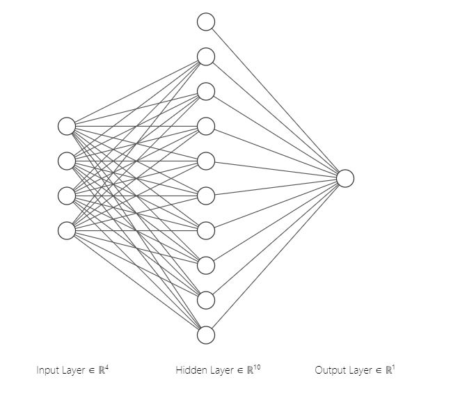

# Snail jumper
**Neuroevolution game.**  
**Fall 2021 - Computational Intelligence.**  

This game has been developed as an assignment for students at Amirkabir University of Technology to apply neuroevolution using a simple game.
  

###Report

I've used FCNN(Fully Connected Neural Network) for the neural network part of this project in nn.py with architecture [4, 10, 1], which means in this NN I've used 4 neurons as input, 10 neurons as hidden layer and 1 neuron for the last layer.

In evolution.py, I've implemented several selection methods such as **top-k**,
**roulette wheel** and **SUS** , and I also have implemented **Q tournament** and
**roulette wheel** for generating new population(in this project new population means new weights for foresaid
neural network).
In the vectorization part (create_input_vector function in player.py) I've used cosine distance between the player and the first and second obstacles, also the normalized position of the player.